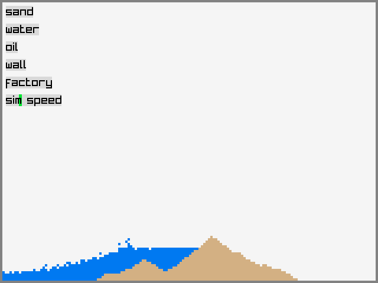

# psim
psim is a particle simulation inspired by [Powder Game](https://dan-ball.jp/en/javagame/dust/).  
  
psim is in early alpha and is very unstable.  

## build

### \*nix:
(with [raylib](https://www.raylib.com/) installed from your distro's repositories)
```sh
make
./psim
```

### Windows:
(with [raylib](https://www.raylib.com/) installed from the [itch.io installer](https://raysan5.itch.io/raylib))
```sh
.\build.bat
.\psim.exe
```
